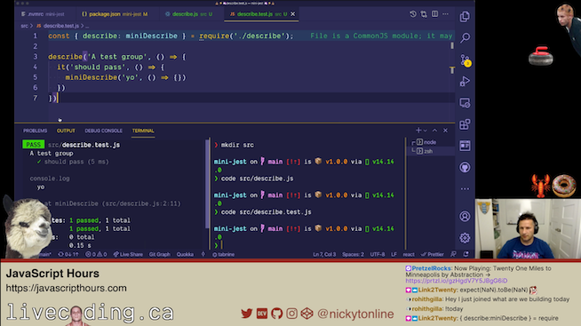

# Creating a mini-jest for fun!

Building this out while streaming at JavaScriptHours.com. This is a repository for just having fun building out something that already exists.

Here's a clip of some of what we've been building out.

  

